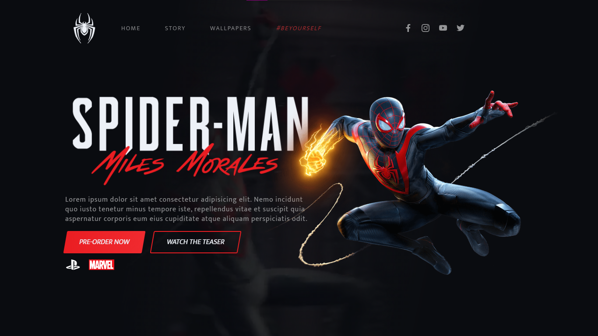
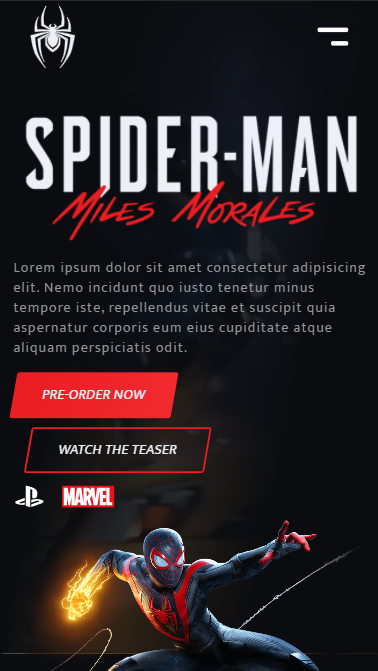

# 🕸️ [#FRONTWEEK] - PROJETO SPIDER-MAN - Miles Morales
____

  <a href="#projeto">O Projeto</a> •
  <a href="#ui">UI Concept</a> •
  <a href="#tecnologias">Tecnologias</a> •
  <a href="#frontend">O Front-End</a> •
  <a href="#autor">Autor</a> •

  

  

## O PROJETO
A proposta era desenvolver uma página com tema do novo Game do Spider. Para este objetivo nos concentramos em desenvolver a Ui Concept do projeto. Em seguida focamos na Codificação de Layout criado usando para isso as tecnologias mais atuais. Por fim, criamos as animações que compõe o MOTION Design.

## PREVIEW
### 💻 DESTOP:

  

### 📱 MOBILE:

  

 

## 🎨 UI Concept

Desenvolvemos a arte da página utilizando o <a href="https://www.figma.com/">FIGMA</a>. 
Link da arte desenvolvida em aula: <a href="https://www.figma.com/file/U9QebNNHc5wZH26ZqsmAxy/Untitled?node-id=0%3A1">UI Concept</a>

## ⚙️ BIBLIOTECAS E TECNOLOGIAS
- <i>SVG - Injection</i> (Biblioteca)
- <i>Sass</i> (Pré-processador CSS)
- <i>Tilt.js</i> (Biblioteca)
- <i>GreenSock - GSAP</i> (Biblioteca)

 

## O FRONT-END
A codificação do projeto feito feito utilizando a IDE, <a href="https://code.visualstudio.com/">VS Code</a>, devido a sua facilidade de trabalhar com os plugins e extensões utéis que possui.

### Link da page: <a href="https://diegoreports.github.io/FRONTWEEK-spider/">https://diegoreports.github.io/FRONTWEEK-spider/</a>

 

## ✏️ AUTOR
A autoria do projeto original pertence ao professor <a href="https://nyousefali.com.br/">Násser Yousef</a>, que guiou a aula com excelente didática e deu todo suporte.

Como aluno, pude aprender os principios da criação de um projeto, desde a sua UI até a codificação e animações que tornam a interface amigável e fluida.

Desenvolvido por <a href="https://www.linkedin.com/in/diego-henrique-sg/">Diego Henrique</a>

